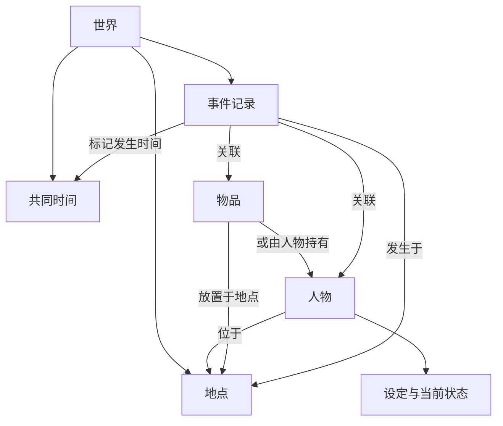

# 人工世界实体模型草案

版本：0.1  
更新日期：2026-10-07

这份模型用于描述小酒馆实验中的空间、人物、物品、时间和事件，使人物能够观察、行动，并给世界留下后果。当前采用四类实体：地点、物品、人物、事件；时间由世界共享。人物的认知、记忆和关系先作为内部记录，具体边界可以随体验调整。

我们已经明确：人物与空间通过观察和行动相互影响，人物和场景中的物体都需要状态。以下字段、分类和规则是供共同讨论的草案，尚未成为实现约束。

## 概念与边界

| 概念 | 定义 | 例子 |
| --- | --- | --- |
| 实体 | 有独立身份、可被其他对象引用的对象或发生记录 | 老板、酒馆大厅、钥匙、一次钥匙交付 |
| 属性 | 描述实体的信息，其中一部分会随时间变化 | 人物姓名、门是否上锁 |
| 设定 | 人物或物品的初始背景与相对稳定的特征 | 老板经营酒馆多年，重视承诺 |
| 状态 | 某个时刻的具体情况 | 老板在柜台，钥匙由旅客持有 |
| 动作 | 人物尝试执行的事情，结果需要结合当前条件判定 | 老板尝试交付钥匙 |
| 事件 | 世界中已经发生的事情，包括动作结果和环境变化 | 钥匙交付成功、交付被拒绝、雨开始下 |
| 时间 | 世界内共同使用的先后顺序和时间位置 | 第一天 20:15 |

属性是总称。设定与状态按用途区分；设定变化通常较慢，仍然可以在经历中改变。人物的初始位置、初始认知和初始关系直接作为初始状态，避免与运行后的状态并存为两份事实。

世界保存实体、当前状态、事件记录与共同时间。规则说明动作在什么条件下能够发生，以及结果如何影响状态；第一版可以用少量具体规则表达。

## 实体及关联总览

| 对象 | 暂定组织方式 | 主要关联 |
| --- | --- | --- |
| 地点 | 核心实体，暂时对应讨论中的场景 | 地点之间可通行；人物和物品位于地点 |
| 物品 | 核心实体，包含固定物体和可携带物品 | 放置于地点或由人物持有；可成为动作目标 |
| 人物 | 核心实体，包含设定和当前状态 | 位于地点、持有物品、与他人有关系、参与事件 |
| 事件 | 有独立标识的发生记录 | 关联时间、地点、人物、物品及结果 |
| 世界时间 | 世界共享的状态 | 标记事件发生时间，参与动作与计划的推进 |
| 认知、记忆、关系、计划 | 人物内部记录 | 引用相关人物、物品、地点或过去事件 |
| 动作与待触发事项 | 行动请求及未来安排 | 条件满足并执行后，产生实际事件 |

地点中的人物和物品清单，由各自的位置查询得到。人物的物品清单由物品的持有关系查询得到。需要显示清单时可以生成，避免各处分别保存互相矛盾的归属。

由人物持有的物品，其实际地点随持有者的位置确定。向某个人物呈现的场景内容再按感知条件筛选：藏在旅客衣袋里的钥匙随他进入大厅，其他人仍可能看不见。

## 地点

### 场景是否需要成为实体

暂时保留地点这个概念，因为它能帮助决定人物是否相遇、能看见或听见什么，以及能够到哪里。本文中的场景先对应一个可定位、可交互的地点，例如酒馆大厅或楼上客房。

地点包含自身的环境和空间条件，加上当时位于其中的人物与物品。即使人离开、物品被带走，地点仍保留自己的身份和状态。

如果最初只有一间没有感知差异的房间，地点可以非常简单。出现隔墙、楼层、私密交谈或离开房间的体验时，再增加地点之间的连接和感知条件。镜头、页面或叙述视角以后可以呈现同一个地点，届时再讨论是否需要独立的展示场景概念。

### 地点的属性

| 属性 | 含义 | 酒馆例子 |
| --- | --- | --- |
| 标识 | 稳定引用这个地点 | 酒馆大厅的唯一标识 |
| 名称与描述 | 人物可认识的地方及其环境特征 | 大厅，柜台靠近入口 |
| 空间连接 | 通向哪些地点，通路受什么条件限制 | 楼梯通向客房，出口受门控制 |
| 感知条件 | 谁在什么情况下能看见、听见相关内容 | 柜台低声交谈在楼上听不清 |
| 当前环境状态 | 会影响当前体验的可变情况 | 灯光昏暗、人声嘈杂 |

门的开关、锁定状态归门这个物体；通路引用门，并根据门的状态判断能否通过。地点中的具体物体保存自己的状态。

首轮可以保留地点标识、描述，以及实际需要的连接和感知条件。灯光、噪声等字段在确实影响观察或行动时加入。

## 物品

物品包括桌子、门等固定物体，以及钥匙、信件、酒杯等可携带物品。只有会参与观察、行动或后果的物体，才需要独立建模；其余细节可以留在环境描述中。

### 物品的属性

| 属性 | 含义 | 例子 |
| --- | --- | --- |
| 标识 | 稳定引用这个物品 | 某一把钥匙的唯一标识 |
| 名称与类型 | 它是什么 | 酒馆门的钥匙 |
| 可观察描述 | 人物能够察觉的外观信息 | 铜制，有一道明显缺口 |
| 所在位置 | 放置于一个地点，或由一个人物持有 | 在柜台上，或由旅客持有 |
| 所有者 | 当前认可的归属，按体验需要加入 | 钥匙属于老板，暂由旅客保管 |
| 相关对象与用途 | 与其他实体的联系及可参与的动作 | 钥匙匹配酒馆门；可拿取、交付、开锁 |
| 当前状态 | 与这个物品类型有关的可变情况 | 门已关闭但未上锁；酒杯装满 |

第一版中，可携带物品只有一个实际位置。持有者与所有者可以不同：交付钥匙改变保管位置，是否转移所有权由交付情境决定。

不同物品使用不同的状态字段。门需要开关和锁定情况；信件可能需要封口和内容；普通钥匙初期只需位置、匹配关系及可观察描述。物品内容即使保存在世界中，也要经过人物阅读或其他获知过程，才能进入其认知。

## 人物

人物由设定、当前状态和可执行动作描述。大语言模型可依据人物实际可用的信息参与理解、表达和选择；模型、提示词及调用方式属于实现配置，具体方案仍待讨论。

玩家也可以作为世界中的人物遵循位置、持有和行动条件，其行动选择来自用户输入。是否为玩家维护显式认知记录，按交互需要决定。

### 人物设定

设定帮助确定人物从哪里来，以及他倾向于怎样面对事情。

| 属性 | 含义 | 例子 |
| --- | --- | --- |
| 标识与姓名 | 稳定身份及可使用的称呼 | 酒馆老板林恩 |
| 身份与背景 | 职业、经历，以及与当前地方的联系 | 经营酒馆多年，曾是村庄的信使 |
| 价值取向 | 重视什么，面对冲突时可能保护什么 | 重视承诺，也想保护家人 |
| 行为倾向 | 常见的表达与选择倾向 | 面对陌生人谨慎，遇到压力会回避追问 |
| 能力与边界 | 能做什么、不能做什么 | 熟悉村中道路，会修门锁 |
| 外观与语言习惯 | 影响辨认和交流的表现，按需要加入 | 袖口沾着酒渍，说话简短 |

生平事实可以保存在世界背景中，人物对往事的记忆、自述和解释另有记录。人物可能隐瞒经历，也可能记错细节。

初始关系与个人认知根据背景建立，随后由事件更新。人物经历重大变化时，可以修订原有倾向并保留原因；初期不需要预先设计完整的人格变化系统。

### 人物当前状态

| 状态 | 含义 | 例子 |
| --- | --- | --- |
| 位置 | 当前在哪里 | 酒馆大厅 |
| 当前活动 | 正在做什么 | 擦杯子，或与旅客交谈 |
| 当前目标 | 此刻希望达成什么 | 在午夜前把一封信送出去 |
| 认知与信念 | 对相关事情的了解、猜测与不确定性 | 相信旅客值得信任，但不知道他的来意 |
| 记忆 | 人物经历或记得的事情及来源 | 记得刚刚交付过钥匙 |
| 人际关系 | 对特定人物的态度、期待和共同经历 | 信任村民，但因旧事不愿向他求助 |
| 意图与计划 | 打算采取的行动及相关时间、条件 | 等旅客离开后去楼上找人 |
| 身体与情绪状况 | 会改变观察或选择的状况，按需要加入 | 疲惫，因信件丢失而紧张 |

人物持有哪些物品从物品位置关系中得到。第一轮优先保留位置、活动、当前目标，以及参与秘密传播的认知、记忆和关系；身体与情绪状态按具体故事需要加入。

### 认知与记忆

世界事实、人物认知和人物说出的内容分别保存。同一件事情可以有不同版本：世界中的钥匙由旅客持有，村民仍相信钥匙在老板手里，旅客也可以声称自己没见过钥匙。

认知记录先包含三项：认为发生了什么、信息从哪里来、目前相信到什么程度。可信程度可以先用“确认、相信、怀疑、未知”等文字表达。听见某人说了一句话，只能直接建立听闻经历；是否相信内容，还需要结合来源和人物关系。

记忆记录包含经历或回忆的内容、相关时间，以及来源。实际经历可以引用相应事件；既有背景、转述和推测要保留各自来源。世界完整的事件记录由系统保存，各人物获得自己能察觉到的内容。

当前目标说明“我现在想要什么”，计划说明“我打算怎样做”，记忆说明“我记得什么”，认知说明“我现在相信什么”。这些记录可以互相影响，初期无需规定必须使用独立的数据表。

### 人际关系

关系先作为从一个人物指向另一个人物的记录。例如老板信任旅客，旅客对老板则仍有戒备。

每条关系可以包含对方的标识、关系背景、当前态度、重要共同经历，以及尚未履行的承诺或冲突。先用具体描述表达；等体验需要比较强弱时，再讨论是否加入数值。

## 事件

事件描述已经发生的事情。它可以由人物动作产生，也可以来自环境变化或到时发生的事项。事件可以改变物体、人物或地点的状态；动作失败也可能留下经历，而目标物体的状态保持原样。

### 事件的属性

| 属性 | 含义 | 例子 |
| --- | --- | --- |
| 标识 | 用于引用和追溯一次发生 | 某次钥匙交付的唯一标识 |
| 发生时间与顺序 | 使用世界时间，同一时刻仍保留先后 | 第一天 20:15，第 8 条事件 |
| 类型与实际内容 | 发生了什么 | 旅客说了一句话；钥匙交付成功 |
| 发生地点 | 涉及的空间，适用时记录 | 酒馆大厅 |
| 发起者与相关对象 | 谁发起，哪些人物和物品受到直接影响 | 老板、旅客、钥匙 |
| 起因 | 对应的动作、前序事件或环境条件，按需要记录 | 老板决定把钥匙交给旅客 |
| 结果与状态变化 | 执行结果及受影响状态的变化 | 钥匙由老板持有变为旅客持有 |
| 可感知的表现 | 用于判断相关人物可能察觉什么 | 柜台附近可看见交付，楼上看不见 |

事件的感知范围可以依据发生时的位置、环境和表现计算。各人物实际接收到的观察另行记录，例如“看见钥匙递出”或“只听见落锁声”。即使察觉同一事件，他们形成的认知也可能不同。

交谈也能产生事件。记录“旅客说钥匙在老板手里”，世界确认的是这句话被说出；钥匙的实际位置仍依据物品状态判断。普通对白可先按一次交谈保存，需要追踪特定消息时再细分。

## 时间和未来事项

### 世界时间

世界共享一个当前时间，例如“第一天 20:15”。事件、记忆中的时间和行动安排都引用同一套世界时间。

| 内容 | 含义 | 暂定选择 |
| --- | --- | --- |
| 当前时间 | 世界运行到哪里 | 日序与日内时间 |
| 时间推进方式 | 什么使世界向前 | 候选是行动和等待推进，尚未选定 |
| 动作耗时 | 一次行动占用多久 | 按动作规则确定，首轮可简化 |
| 到时检查的事项 | 到某时刻需要检查或尝试什么 | 午夜钟声，人物约定的行动 |

先讨论世界内部的时间连续性。玩家关闭界面后是否按现实时间继续、重返时如何处理经过的时间，留待需要该体验时决定。

### 计划和到时触发

“老板计划午夜离开”属于人物计划；“午夜检查是否离开”属于待触发事项；“老板实际离开”才属于已发生事件。人物可以因新信息改变计划，也可能在执行时遇到阻碍。

待触发事项先包含时间或条件、将尝试的动作或环境变化，以及关联计划或规则的引用。时间推进到该点时，检查计划是否仍有效和条件是否满足，再执行并记录结果。计划更改后，相关安排需要同步失效或更新。

## 动作如何连接状态和事件

人物动作先描述谁尝试做什么、针对什么对象，以及必要的内容。第一轮候选动作包括说话、移动、拿取、交付、使用物品和等待；具体集合由故事选择。

一次动作按以下关系处理：

1. 依据人物的观察、记忆、目标和关系，提出动作。
2. 结合当时的世界状态检查条件，例如是否在场、是否持有钥匙、钥匙是否匹配门。
3. 确定结果，一致地更新受影响状态，并记录对应事件。
4. 判断哪些人物能够察觉什么，让观察进入各自的经历与认知。
5. 人物据此调整活动、目标或计划，形成后续动作。

这些条件可以给行动提供边界，同时让人物在可行范围内作出选择。首轮可按明确顺序处理动作；需要多人同时行动时，再讨论耗时、打断和冲突。

## 一次酒馆经历的建模示例

以下仅用于检查概念能否连起来。时间间隔是示例，并未确定动作的实际耗时。

初始情况：老板和旅客在大厅，村民在楼上；钥匙由老板持有，匹配酒馆出口的门；门关闭但未上锁。楼上看不见柜台，能听见明显的落锁声。老板愿意暂时把钥匙交给旅客，旅客想隐瞒这次交付。

| 世界时间 | 发生的事情 | 世界状态或经历 | 人物获得的信息 |
| --- | --- | --- | --- |
| 20:00 | 老板把钥匙交给旅客 | 钥匙的持有者变为旅客，所有者仍为老板 | 两人直接经历交付；村民没有察觉 |
| 20:01 | 旅客用钥匙锁门 | 门变为已上锁 | 老板看见；村民只听见落锁声 |
| 20:02 | 村民下楼查看出口 | 村民的位置变为大厅；他观察门的锁扣 | 村民确认门已上锁，仍不知道谁锁的 |
| 20:03 | 村民询问，旅客声称钥匙仍在老板手里 | 保存这次交谈；钥匙仍由旅客持有 | 村民收到旅客的说法，是否相信尚需判断 |
| 20:04 | 村民尝试直接推门出去，未能通过 | 村民仍在大厅，门仍上锁；保存这次失败经历 | 村民知道需要开锁或寻找其他办法 |

这段经历涉及地点、连接条件、物品状态、人物意图、信息差、时间和事件。怎样判断他人说法、如何选择下一次行动，仍需要后续体验检验。

## 首轮最小范围

第一轮可以从一座酒馆、一到几个地点、少量人物、一件会影响行动的物品，以及一个共享时钟开始。核心字段如下：

- 地点：身份、描述、必要的连接与感知条件。
- 物品：身份、位置或持有者、与行动有关的状态及用途。
- 人物：身份和背景、行为与价值倾向、位置、活动、当前目标、相关认知、记忆和关系。
- 事件：身份、时间与顺序、相关对象、实际发生的内容、结果及可感知表现。
- 时间：当前世界时间，以及一种明确的推进方式。

字段可以在具体人物和事件出现后调整。每个新增字段需要能说明它影响了哪次观察、选择或后果。

## 待讨论的模型选择

| 问题 | 当前草案 | 调整它的依据 |
| --- | --- | --- |
| 是否保留场景实体 | 先以地点表达场景 | 单一房间可简化；呈现方式与地点开始分离时再细分 |
| 人物设定如何划分 | 背景与倾向作为设定，运行中的情况作为状态 | 同一信息出现重复或冲突时重新划分 |
| 认知、记忆和关系怎样保存 | 先保留文字描述、来源和相关实体引用 | 难以查询、持续更新或控制信息范围时增加结构 |
| 时间怎样推进 | 优先讨论行动和等待推进 | 需要实时压力、同时行动或离线变化时调整 |
| 人物何时主动行动 | 时间推进或相关变化时提供行动机会 | 试玩暴露人物只在被问话时活动的问题时检验 |
| 事件需要多细 | 先记录会影响经历或后果的动作与交谈 | 信息传播和因果追溯需要更多细节时细分 |

下一次可用一个具体人物和一件物品填入这份模型，走完一次观察、行动、事件与状态变化，寻找缺失和重复的属性。
